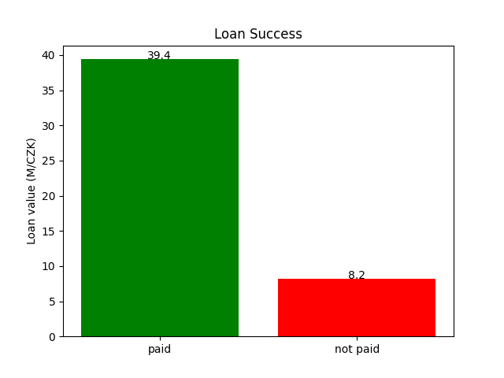

# AC 2022/23 - Business Understanding

## Analysis of requirements with the end user

- As a user, I want to predict most of loan requests whose clients would not pay, so that I can minimize my bussiness losses.

- As a user, I want to predict a significant amount of loan requests whose clients would pay, so that I can maximize my business gains.

A user wants to use the system to improve their business's profits. For that, the system should correctly predict whether a loan will be paid or not, based on the client data, p.e its transactions. 

However, it's important to prioritize the loans that will not be paid, since those lead significantly to company monetary losses.

---- 

## Definition of business goals

Currently, many bank companies give a lot of loans that are not paid, which leads to huge monetary losses.
In the dataset provided, the company lost 8.2 million CZK on loans that were not paid, and won 39.4 million CZK on loans paid, leading to
around 82.8% of the money invested returned.

Reducing these losses is extremely important and the main business goal of this project. Thus, the project should accomplish
a reduction of at least 85% of unpaid loans, so that the company will have most of its money "invested" in clients returned.

Despite this reduction, it's also important not to reduce the profits made by the company, thus the % of paid loans should not decrease (leading to an increase in profits).

In the dataset provided, this would lead to a return of the money invested of, approximately, 97%, having losses of around 1.2 million CZK and 
maintaining profits of 39.4 million CZK.

----

## Translation of business goals into data mining goals

The goal of the data mining to be done on this project is to determine when a Loan, associated with an Account, won't end successfully, that is, it will not be totally paid. However, the data mining to be done on this project should prioritize the reduction of the unpaid loans instead of maximizing the number of paid loans, leading to most significantly the reduction of the company losses instead of maximizing the company revenue received from paid loans.

Therefore, the data mining goals can be defined as follows:

- Collect a dataset containing a significant amount of loans, clients and other bank information.

- Analyze the data in order to better understand it. Generate relevant statistics, tables and plots.

- Prepare and process the data based on the analysis done previously, so we can use it correctly on the predictive models.

- Build a machine learning model based on the preparation done previously, evaluate its results and review all the process done in case the results are not the expected.

